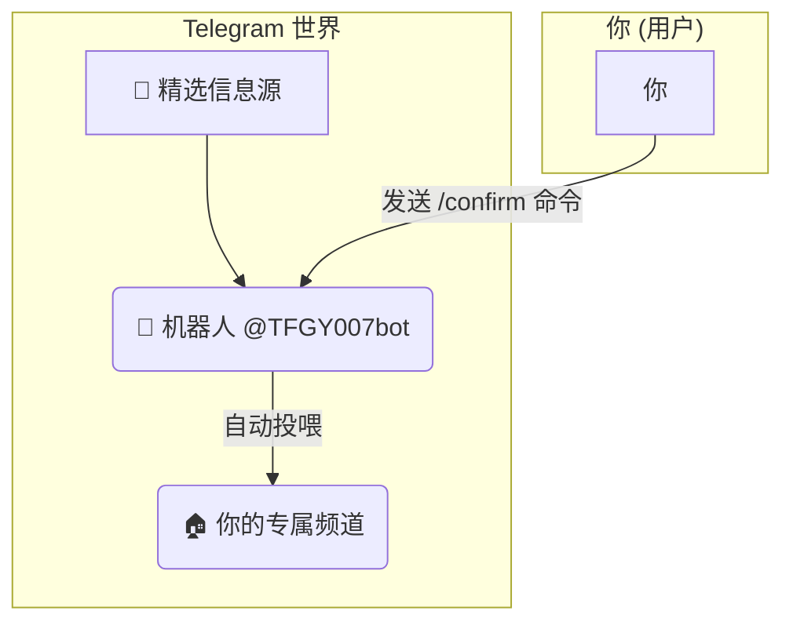

# 🤖 TG 信息自动转发机器人搭建教程 (小白专享版)

# 官方频道：https://t.me/TFGY111

核心流程就是：**拉机器人 → 设管理员 → 发送 `/confirm` → 激活成功**。
---

# 🤖 打造你的专属信息聚合器：TG 自动转发机器人使用指南 (终极全自动版)

嘿！朋友！👋

你是否曾梦想过，能像拥有一个超能力一样，将散落在 Telegram 各个角落的精华信息，自动汇聚到你的私人领地？🤔

现在，梦想成真了！本教程将带你使用我们的机器人 `@TFGY007bot` 和 Cloudflare 的免费魔法 ✨，轻松搭建一个**完全免费、稳定可靠、并且能自动订阅**的专属信息转发系统。

**最终效果？**
你只需要简单几步操作，就能让一个精选的“信息源”频道，像长了翅膀一样，把最新消息实时、自动地投喂到你自己的频道里！
---

## 🧐 它是怎么工作的？(三句话讲明白)

别担心，整个过程超级简单，就像在网上订阅一份你喜欢的电子杂志一样！

1.  **选择杂志 (准备工作)** 📚
    你先创建一个自己的空频道，这就像准备一个专属的“邮箱”，用来接收杂志。

2.  **填写订阅单 (核心操作)** ✍️
    你通过一个简单的命令 `/confirm`，告诉我们的机器人小哥：“嘿，以后所有新杂志都往我这个邮箱里送！”

3.  **享受阅读 (自动接收)** ☕️
    搞定！从此以后，只要“杂志社”（我们的信息源）一出新刊，机器人小哥就会光速把它送到你的“邮箱”里。全程自动，你只管享受！

### 简单架构图



---

## 🛠️ 准备工作 (出发前的检查)

在开始订阅之前，请确保你已经准备好了：

1.  **一个 Telegram 账号** (这必须有！😂)
2.  **一颗探索的心** ❤️：跟着教程一步一步来，你会发现新大陆！

---

## 🚀 订阅教程：三步搞定，即刻激活！

### 第一步：创建你的“专属邮箱” (创建目标频道)

你需要一个自己的频道来接收所有信息。

1.  在 Telegram 主界面，点击菜单（左上角三道杠或右下角铅笔图标）> **“新建频道” (New Channel)**。
2.  给你的频道起个你喜欢的名字，比如“我的资讯小站”、“每日必读”等，再选个好看的头像。
3.  在设置频道类型时，我们推荐选择 **“个公开频道” (Private Channel)**，这样可以盈利。

### 第二步：邀请“机器人管家”入驻

这是最关键的一步，你需要把我们的机器人管家请进你的频道。

1.  进入你刚刚创建的频道，点击顶部的频道名称。
2.  选择 **“管理员” (Administrators)**。
3.  点击 **“添加管理员” (Add Admin)**。
4.  在弹出的搜索框里，像找朋友一样输入我们的机器人管家大名：`@TFGY007bot`，然后选中他。
5.  在权限设置页面，别的都不用管，只要确保 **“发布消息 (Post Messages)”** 这个开关是打开的 ✅，然后点击右上角的对勾确认。

太棒了！你的专属管家已经就位，随时准备为你服务。

### 第三步：发送“激活咒语” (确认订阅)

万事俱备，只欠东风！现在，我们来发送激活咒语，正式开启订阅。

1.  回到你的频道主界面。
2.  在输入框里，输入下面这条神奇的命令，然后发送：
    ```
    /confirm
    ```
3.  发送后，机器人管家会立刻回复你一条消息：“✅ **订阅成功！**...”

**🎉 恭喜你！激活成功！🎉**

从这一刻起，你的专属信息聚合器已经正式开始工作了！

---

## 🥳 见证奇迹的时刻

现在，你什么都不用做，只需要像平时一样使用 Telegram。当我们的“精选信息源”有任何新动态时，你的频道就会在几秒钟内收到一模一样的消息。

你已经拥有了一个全天候、不知疲倦为你筛选和搬运高质量信息的好帮手！

## ❓ 常见问题 (Q&A)

**问：如果我不想接收了，怎么退订？**
答：非常简单！只需要在你的频道里，发送另一条命令 `/unsubscribe`，机器人就会为你办理退订，并停止推送。

**问：这个服务真的免费吗？**
答：是的，完全免费！我们利用了 Cloudflare 的免费服务来支持机器人的运行，你可以放心使用。

**问：我的频道信息会泄露吗？**
答：请放心。我们只会在你订阅时获取你频道的 ID 用于推送消息，不会也无法获取你频道的其他任何信息。你的隐私是绝对安全的。

**问：如果我还有其他问题怎么办？**
答：你可以随时私聊我们的机器人 `@TFGY007bot`，发送 `/start`，获取帮助信息或联系方式。

希望这篇教程能让你玩得开心！享受信息自动化的乐趣吧！🚀

下游用户，什么技术操作都不用做！

他们不需要：

❌ 注册和登录 Cloudflare。
❌ 创建和部署任何 Worker。
❌ 复制和粘贴任何代码。
❌ 手动去获取自己频道的 ID。
❌ 了解任何关于 Webhook、环境变量的知识。
下游用户的全部操作，简化为三步“傻瓜式”操作：
创建频道：在 Telegram 里点几下，创建一个自己的私密频道。
加机器人：把你的机器人 @TFGY007bot 加到这个频道里，设为管理员。
发命令：在频道里打字发送 /confirm。
结束了！

他们的所有操作到此为止。剩下的所有魔法，包括自动获取他们的频道 ID、把他们加入到分发列表、未来持续给他们推送消息，都由你已经部署好的那一个“终极版”Worker 在后台全自动完成。


