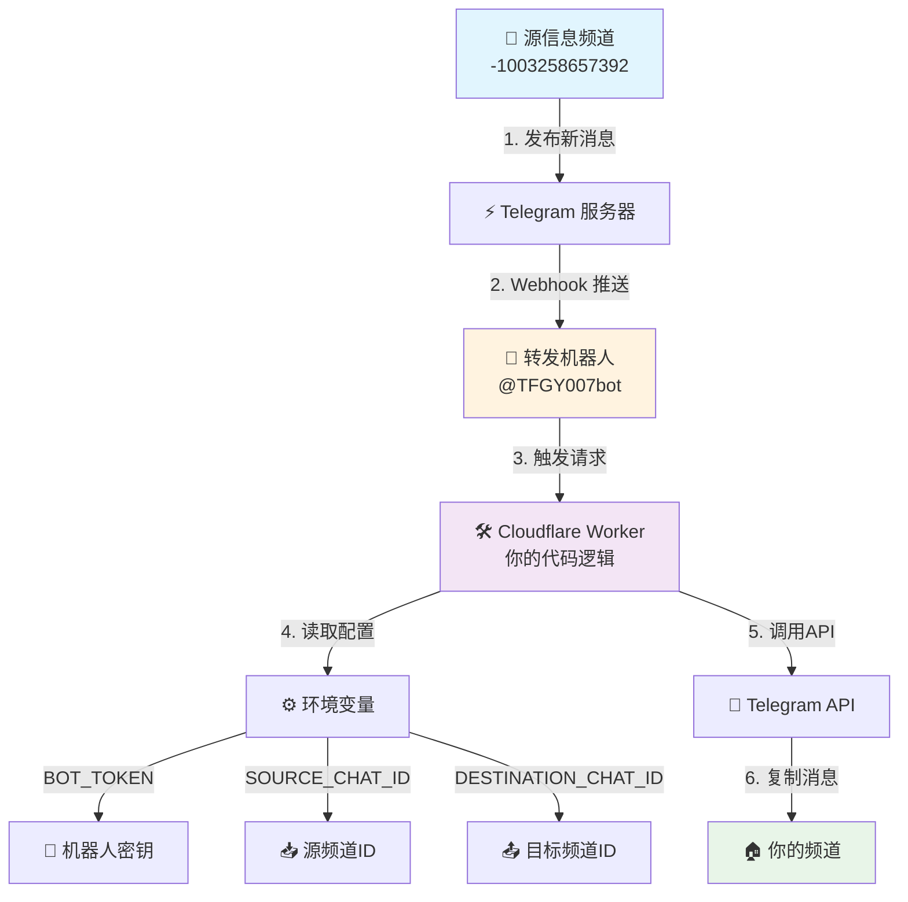

# 🤖 TG 信息自动转发机器人搭建教程 (小白专享版)

# 官方频道：https://t.me/TFGY111

你好！欢迎使用本教程。本教程将手把手教你如何利用 Cloudflare Workers 的免费服务，搭建一个属于你自己的 Telegram 信息转发机器人。

**最终效果**：自动将指定频道的最新消息，实时、无延迟地转发到**你自己的频道**里。

> 💡 **核心优势**
> - 🆓 **完全免费** - 使用 Cloudflare 的免费额度
> - ⚡ **实时转发** - 几秒钟内完成消息同步
> - 🔒 **稳定可靠** - 基于 Cloudflare 全球网络
> - 🛠️ **简单易用** - 无需编程经验，跟着做就行

## 🎯 最终效果展示

当源频道发布新消息时，你的个人频道会立即收到相同的消息：

```
[源频道] --发布消息--> [你的频道]
     ⏱️ 延迟：2-5秒
```

## 🏗️ 系统架构原理

整个系统就像一场精密的接力赛，每个环节各司其职：

### 系统架构图



### 工作流程详解

1. **📨 消息发布** - 源频道 (`-1003258657392`) 发布新内容
2. **🔔 实时通知** - Telegram 通过 Webhook 立即通知我们的机器人
3. **🖥️ 逻辑处理** - Cloudflare Worker 验证消息来源并执行转发逻辑
4. **📤 消息复制** - 通过 Telegram API 将消息复制到你的频道

## 📋 准备工作

在开始之前，请确保你已准备好以下内容：

| 序号 | 所需物品 | 说明 | 状态 |
|-----|----------|------|------|
| 1 | 📱 Telegram 账号 | 必须的通行证 | ✅ 应该有 |
| 2 | 🌐 Cloudflare 账号 | [免费注册](https://dash.cloudflare.com/sign-up) | ⬜ 待准备 |
| 3 | ⏱️ 15分钟时间 | 完整跟着教程操作 | ✅ 已准备 |

> 🚀 **预计完成时间**：15-20分钟

---

## 🚀 教程开始：三步搭建你的转发系统

### 第一步：🏠 创建你的目标频道

我们需要创建一个"你专属的频道"来接收转发的消息。

#### 操作步骤：

1. **打开 Telegram**，点击左上角菜单 ≡ → **"新建频道"**
   
2. **设置频道信息**：
   - 📛 **频道名称**：如"某某18禁等等的，你都可以自己想"
   - 🖼️ **频道头像**：选个xx的图片比较有感觉
   - 🔒 **频道类型**：**你可以选择公开频道，毕竟后面要赚钱的嘛"**

3. **添加机器人管理员**：
   ```bash
   # 进入你的频道 → 先把@TFGY007bot拉进来 →  点击频道名称 → 管理员
   # → 添加管理员 → 搜索 @TFGY007bot
   # → 开启"发布消息"权限 → 确认
   ```

4. **权限设置确认**：
   ✅ 发布消息
   ❌ 其他权限保持默认

> 💡 **提示**：这一步为了让我这边的机器人能转发信息给你

### 第二步：📍 获取频道地址（频道ID）

机器人需要进入到你的频道，这就是频道ID。

#### 操作步骤：

1. **查找ID机器人**：
   - 在 Telegram 搜索框中输入 `@get_id_bot`
   - 启动该机器人

2. **转发测试消息**：
   ```bash
   # 在你的私密频道中发送任意消息
   # 长按该消息 → 转发 → 选择 @get_id_bot
   ```

3. **获取频道ID**：
   - `@get_id_bot` 会回复类似信息：
   ```
   Forwarded from channel
   ID: -1001234567890
   Name: 你的频道名称
   ```

   


4. **保存重要信息**：
   📝 **请复制以 `-100` 开头的数字串**，这就是你的 `DESTINATION_CHAT_ID`

> 🎯 **示例**：`-1001234567890`（你的会不同）

### 第三步：🧠 部署转发大脑（Cloudflare Worker）

这是最核心的步骤，别担心，跟着做就能成功！

#### 3.1 创建 Worker 服务

1. **登录 Cloudflare**：
   - 访问 [Cloudflare Dashboard](https://dash.cloudflare.com)
   - 左侧菜单点击 **`Workers & Pages`**

2. **创建新服务**：
   - 点击 **"创建应用程序"**（蓝色大按钮）
   - 选择 **"Workers"** 标签页
   - 点击 **"创建 Worker"**

3. **基础配置**：
   - **服务名称**：`my-telegram-forwarder`（可自定义）
   - 点击 **"部署"**

#### 3.2 部署转发代码

1. **进入代码编辑器**：
   - 部署成功后，点击 **"编辑代码"**

2. **替换代码内容**：
   - 删除编辑器中的所有默认代码
   - 复制粘贴以下完整代码：

```javascript
export default {
  async fetch(request, env) {
    // --- 1. 从环境变量中安全地获取配置 ---
    const BOT_TOKEN = env.BOT_TOKEN;
    const SOURCE_CHAT_ID = env.SOURCE_CHAT_ID;
    const DESTINATION_CHAT_ID = env.DESTINATION_CHAT_ID;
    const TELEGRAM_API_BASE = `https://api.telegram.org/bot${BOT_TOKEN}`;

    // 调试日志：打印出配置信息，检查是否正确读取
    console.log(`Source Chat ID: ${SOURCE_CHAT_ID}`);
    console.log(`Destination Chat ID: ${DESTINATION_CHAT_ID}`);

    /**
     * 调用 Telegram API 来复制消息
     */
    async function copyTelegramMessage(chatId, messageId) {
      const url = `${TELEGRAM_API_BASE}/copyMessage`;
      const payload = {
        chat_id: DESTINATION_CHAT_ID,
        from_chat_id: chatId,
        message_id: messageId,
      };

      // 调试日志：打印将要发送给 Telegram 的请求内容
      console.log('Sending copyMessage request with payload:', JSON.stringify(payload));

      const response = await fetch(url, {
        method: 'POST',
        headers: { 'Content-Type': 'application/json' },
        body: JSON.stringify(payload),
      });

      // 调试日志：打印 Telegram API 的返回结果
      const responseBody = await response.json();
      console.log('Telegram API response:', JSON.stringify(responseBody));
      
      if (!responseBody.ok) {
        console.error('Error from Telegram API:', responseBody.description);
      }
    }

    // --- 2. 主逻辑开始 ---
    if (request.method === 'POST') {
      try {
        const update = await request.json();
        
        // 调试日志：打印从 Telegram 收到的完整 Webhook 数据
        console.log('Received update from Telegram:', JSON.stringify(update, null, 2));

        const message = update.channel_post || update.message;
        
        if (message) {
          // 调试日志：打印收到的消息的 chat.id
          console.log(`Message received from chat.id: ${message.chat.id}`);

          // --- 3. 检查消息是否来自指定的源频道 ---
          if (String(message.chat.id) === SOURCE_CHAT_ID) {
            console.log('Chat ID matches SOURCE_CHAT_ID. Proceeding to copy message.');
            await copyTelegramMessage(message.chat.id, message.message_id);
          } else {
            console.log('Chat ID does not match. Ignoring message.');
          }
        } else {
          console.log('No processable message found in the update.');
        }
      } catch (e) {
        console.error('An error occurred:', e.stack);
      }
    }
    
    // --- 4. 立即返回成功响应给 Telegram ---
    return new Response('OK', { status: 200 });
  },
};
```

3. **保存部署**：
   - 点击 **"保存并部署"**

#### 3.3 配置环境变量（最关键步骤！）

1. **进入设置页面**：
   - 返回 Worker 管理页
   - 点击 **"设置"** → **"变量"**

2. **配置三个核心变量**：

| 变量名 | 值 | 说明 | 是否加密 |
|--------|-----|------|----------|
| `BOT_TOKEN` | `7897576280:AAEu4t5aXMP9ZY849z5vAo7Ly2_6DImbTOg` | 机器人身份凭证 | ✅ 加密 |
| `SOURCE_CHAT_ID` | `-1003258657392` | 信息源频道 | ❌ 不加密 |
| `DESTINATION_CHAT_ID` | 你第二步获取的ID | 你的目标频道 | ❌ 不加密 |

**具体操作**：
- 点击 **"+ 添加变量"**
- 按上表依次添加三个变量
- **特别注意**：`BOT_TOKEN` 务必点击 **"加密"**
- 完成后点击 **"保存并部署"**

#### 3.4 激活 Webhook（建立连接）

1. **获取你的 Worker URL**：
   - 返回 Worker 概览页
   - 复制顶部 URL（格式：`https://你的服务名.你的子域名.workers.dev`）
   - 


2. **设置 Webhook**：
   - 打开浏览器新标签页
   - 访问以下 URL（**请替换 `<你的Worker URL>`**）：
   ```
   https://api.telegram.org/bot7897576280:AAEu4t5aXMP9ZY849z5vAo7Ly2_6DImbTOg/setWebhook?url=你的Worker URL
   ```
 **记得把上面这条信息后面的你的woker url 换成上面那个哈 **
   

3. **验证成功**：
   - 如果看到以下响应，说明成功了：
   ```json
   {
     "ok": true,
     "result": true,
     "description": "Webhook was set"
   }
   ```

## 🎉 大功告成！

恭喜！你已经成功搭建了一个全自动的消息转发系统。

### 测试你的系统

现在你可以：
1. **观察源频道**的新消息发布
2. **检查你的公开频道**是否在几秒内收到相同消息
3. **查看 Cloudflare Worker 日志**（在 Worker 的"日志"标签页）了解运行状态

### 故障排除

如果遇到问题，请检查：

| 问题现象 | 可能原因 | 解决方案 |
|----------|----------|----------|
| ❌ 收不到消息 | Webhook 未设置成功 | 重新执行 3.4 步骤 |
| ❌ 权限错误 | 机器人不是管理员 | 重新执行第一步第3小步 |
| ❌ 频道ID错误 | DESTINATION_CHAT_ID 错误 | 重新获取并配置频道ID |

---

## 🚀 进阶玩法：构建你的信息网络

掌握了基础转发后，你还可以：

### 方案一：多源聚合
```
[源频道A] ─────┐
               ├─ [你的主频道] 
[源频道B] ─────┘
```

### 方案二：信息分发
```
              [客户A频道]
[源频道] ─── [你的频道] ─── [客户B频道]
              [客户C频道]
```

**实现方法**：为每个转发路径创建独立的 Cloudflare Worker，仅需修改 `SOURCE_CHAT_ID` 和 `DESTINATION_CHAT_ID`。

## 📞 技术支持

如果遇到问题：
1. 首先检查本教程的每个步骤
2. 查看 Cloudflare Worker 日志
3. 确认频道ID和权限设置

---

## 🎯 系统配置总结

| 组件 | 值 | 说明 |
|------|-----|------|
| 🤖 机器人 | @TFGY007bot | 消息处理核心 |
| 📥 源频道 | -1003258657392 | 信息来源 |
| 🛠️ 运行平台 | Cloudflare Workers | 免费、稳定 |
| ⚡ 转发延迟 | 2-5秒 | 近乎实时 |

**祝你使用愉快！** 🎊

> ⚠️ **重要提醒**：请勿泄露你的 `BOT_TOKEN` 和频道ID，确保系统安全。
